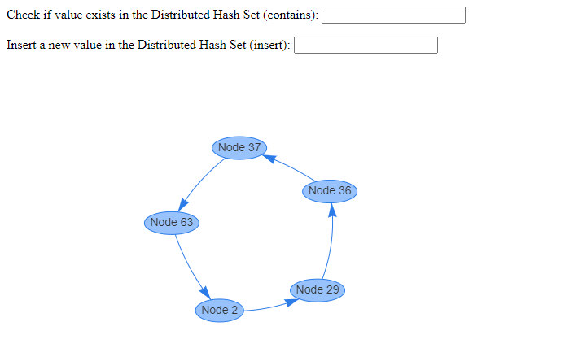
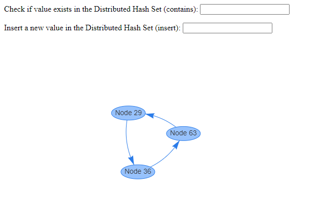

# crust

Crust is an implementation of [Chord](https://en.wikipedia.org/wiki/Chord_(peer-to-peer)) in Rust. On top of this, crust also builds a Distributed Hash Set that uses the underlying Chord mechanism. Click [here](https://github.com/a3y3/crust/projects/1) to see how we approached, planned, and worked on the project!

## Basic mechanism
Here's how the application looks like:

Use the forms to insert a new value in the network (the application will return the ID of the node where the key was inserted) or verify if a key exists anywhere in the network.

## Failure Handling
If nodes fail, failure recovery is triggered that correctly adjusts the ring. Note that key lookups can still work because of replicas that exist in other existing nodes.

## Build
`docker build . -t crust`

## Run
- To start the first node: `docker run --init --rm -p 8000:8000 crust`
- Open a browser and go to `localhost:8000` to see the Chord ring.
- To start the second node: open a new Terminal window and see the IP address from the output of the first node. For example, if it's `172.17.0.2`, run `docker run --init --rm -p 8001:8000 crust -- 172.17.0.2`
- The open tab in your browser should automatically add the second node in the Chord ring (might take a few seconds to reflect)

Authors:

- Soham Dongargaonkar
- Gagan Hegde
